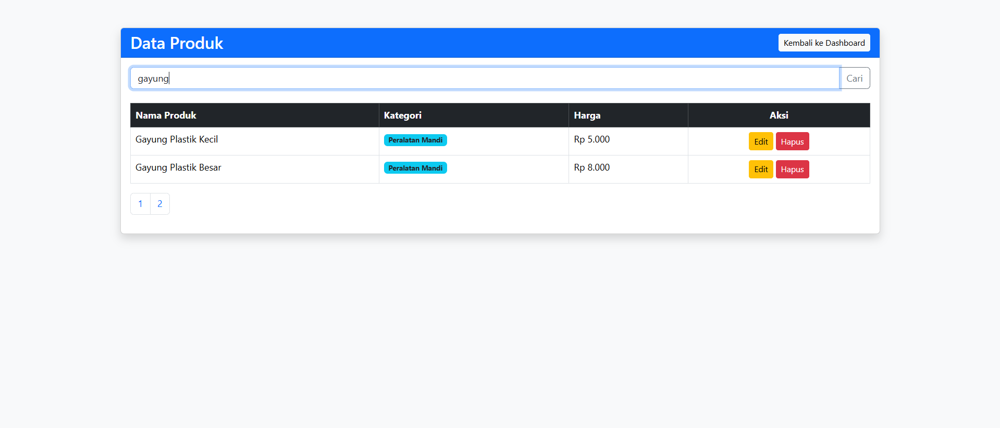
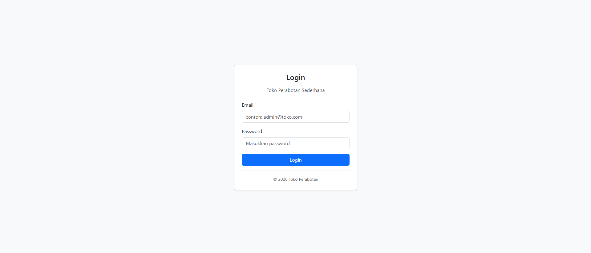
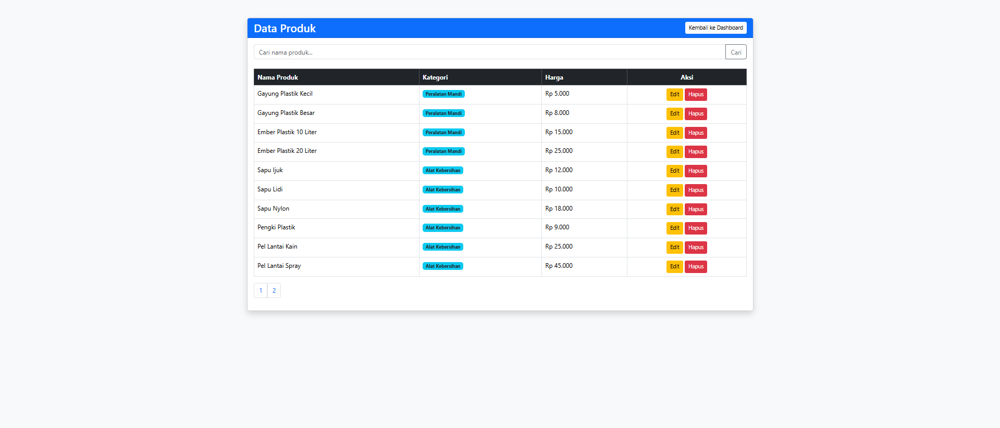
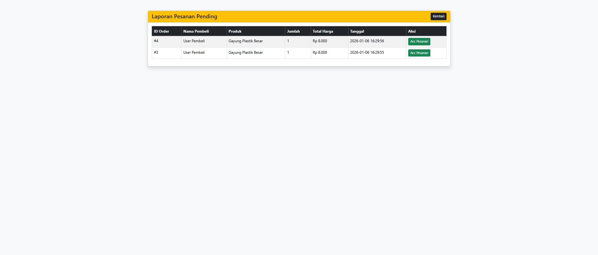

# Toko Perabotan - Web Management System

## Fitur
- Admin  : Dashboard statistik, CRUD, Laporan pesanan masuk, dan proses ACC pesanan.
- User   : Katalog produk dengan pagination, sistem checkout, dan riwayat pesanan.
- Security : Sistem login menggunakan hash, dan pembatasan hak akses.

 ## Demo akun
 - Admin : email: admin@toko.com, password: admin123
 - User  : email: user@toko.com, password: user123

## Konfigurasi database
- BukaphpMyAdmin dan buat database baru bernama toko_perabotan.
- Import file .sql yang berada di folder database.

## Jalankan aplikasi 
- letakkan folder didalam .htdocs.
- Akses melalui browser di: http://localhost/perabot/public/

### Filter pencarian
Dalam Sistem ini juga terdapat fitur pencarian yang bekerja pada ```produk.php``` terdapat metode ```method="get"``` lalu di ```DashboardController::produk()```
kode mengambil nilai: ```$keyword = isset($_GET['search']) ? $_GET['search'] : '';``` dan variabel ```$keyword``` dikirim ke fungsi ```getAll()``` di ```produkModel.php```
lalu sql menggunakan operator ```LIKE```: ```SELECT * FROM produk WHERE nama_produk LIKE '%$keyword%'``` yang tanda ```%``` berarti mencari kata yang mengandung kalimat tersebut.
- Filter pencarian:


### Pagination
Pagination bekerja agar server tidak berat saat memuat ribuan data dalam sekaligus.  Controller mengecek parameter ```?page=``` di URL, jika tidak ada maka dianggap halaman 1.
```$halamanAktif = isset($_GET['page']) ? (int)$_GET['page'] : 1;``` dan Offset ini adalah bagian yang lumayan penting, karena offset ini berfungsi sebagai dimanakan baris pertama dimulai
Jika halaman 1: ```(1-1) * 10 = 0``` mengambil dari baris ke-0, dan halaman 2:```(2-1) * 10 = 10``` Lompati baris 10 pertama, ambil dari baris ke-11.
- Pagination:


## Screenshhot UI
- Login

- Dashboard Admin:

- Produk

- Laporan

- Dashboard User:

